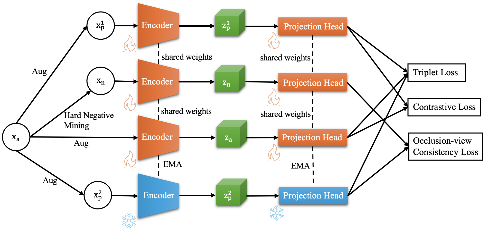

## SHAM: Self-Supervised Hard-negative Curriculum for Hair-Centric Image Retrieval

Official implementation and benchmark for
“A Self-Supervised Framework for Robust Hair-Centric Image Retrieval”

🧠 Method: HSimCLR (Hair SimCLR)

## 🔍 Overview

<p align="center">
  
</p>

This repository provides:
1. HSimCLR, a self-supervised learning framework tailored for hair-centric representation learning

2. Training & evaluation code for multiple backbones (ResNet, ViT)

3. Scripts for reproducible experiments and evaluation

## Code Structure
The main training code for SSL is in folder HairPretraining

```text
HairPretraining/
├── configs/                          # Config YAML
│   ├── pretrain_mae.yaml
│   └── pretrain_simclr.yaml
│
├── data/                             # CSV train/test
│   ├── data_train.csv
│   ├── data_test.csv
│   ├── data_train_full_face.csv
│   ├── data_test_full_face.csv
│   ├── data_train_combination3.csv
│   ├── data_test_combination3.csv
│   ├── figaro_training.csv
│   └── figaro_testing.csv
│
├── src/                              # Main source
│   ├── backbone.py                  # Backbone CNN / ViT
│   ├── models_vit.py                # Vision Transformer models
│   ├── masked_vision_transformer_timm.py
│   ├── main_backbone.py
│   ├── pretrain_engine.py           # Training loop cho pretraining
│   ├── classification_engine.py     # Linear probe / kNN classification
│   ├── neg_sampling.py              # Hard negative / negative sampling
│   └── __init__.py
│
├── utils/                            
│   ├── dataloader.py                # DataLoader
│   ├── transform.py                 # Data augmentation
│   ├── losses.py                    # Loss functions
│   └── utils.py
│
├── scripts/                          # Experiment Script 
│   ├── pretraining/                 # Script pretrain (SimCLR, MAE, SHAM…)
│   ├── classification/              # Script kNN / linear probe
│   │   ├── celebA/
│   │   ├── figaro/
│   │   └── k_hairstyle/
│   ├── ablation_study/               # Ablation experiments
│   ├── inter_intra_class/            # Inter/Intra-class analysis
│   └── visualization/                # Script to draw UMAP / embedding
│
├── mainpretrain.py                   # Entry point pretraining
├── knn_classification.py             # Run kNN evaluation
```

# ⚙️ Installation
``` text
git clone https://github.com/atunnd/Hair-centric-Image-Retrieval.git
conda create -n hair_ci python=3.9
conda activate hair_ci
pip install -r requirements.txt
cd HairPretraining
```

